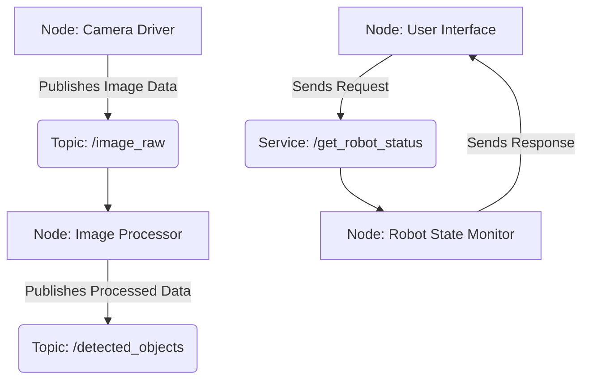

# Chapter 1: An Introduction to ROS 2

Welcome to the world of modern robotics! This chapter will introduce you to the Robot Operating System 2 (ROS 2), the foundational software stack that powers countless robots, from autonomous drones to complex humanoid assistants.

## What is ROS 2?

ROS 2 is an open-source set of software libraries and tools for building robot applications. Think of it as a "meta-operating system" for your robot. It's not a traditional OS like Windows or Linux, but rather a flexible framework that runs on top of them. Its primary goal is to simplify the task of creating complex and robust robot behavior across a wide variety of robotic platforms.

ROS 2 provides services you would expect from an operating system, including:
*   **Hardware abstraction:** Control a robot's hardware without needing to know the low-level specifics.
*   **Low-level device control:** A common interface for controlling sensors and actuators.
*   **Message-passing:** A way for different parts of your robot's software to communicate.
*   **Package management:** A way to organize and reuse your code.

### Why ROS 2 over ROS 1?

ROS 1, the predecessor to ROS 2, revolutionized robotics by providing a standardized platform. However, it had limitations, especially for commercial and real-world applications. ROS 2 was designed from the ground up to address these, offering:

*   **Multi-robot support:** Improved capabilities for systems with multiple robots.
*   **Real-time control:** Better support for time-critical applications.
*   **Improved security:** Features for secure communication between different parts of the system.
*   **Cross-platform compatibility:** Officially supports Linux, macOS, and Windows.

## Core ROS 2 Concepts

At its heart, a ROS 2 system is a distributed network of processes that communicate with each other. These processes are called **nodes**. Let's break down the fundamental concepts.

### Nodes

A **node** is the smallest unit of computation in ROS 2. Each node should be responsible for a single, specific task, such as controlling a wheel motor, reading a sensor, or planning a path. By breaking down a complex system into many small, modular nodes, you create a system that is easier to debug, test, and reuse.

### Topics

Nodes communicate with each other by publishing and subscribing to **topics**. A topic is a named bus over which nodes exchange messages. Topics are one-way communication channels: a publisher sends a message on a topic, and any number of subscribers can listen to that message. This "many-to-many" communication is a cornerstone of ROS 2's flexibility.

### Services

While topics are for continuous data streams, **services** are used for request/reply interactions. A node can offer a service, and another node (a client) can send a request and wait for a response. This is similar to a remote procedure call (RPC) and is useful for tasks that have a clear start and end, like "get the robot's current position."

### Actions

**Actions** are for long-running tasks that provide feedback. Like services, actions have a request/reply model, but they are more complex. An action client sends a goal to an action server (e.g., "rotate 360 degrees"). The server then executes the task, providing regular feedback (e.g., "rotated 90 degrees," "rotated 180 degrees") and a final result when the goal is complete.

### The ROS 2 Graph

These components—nodes, topics, services, and actions—form what is known as the **ROS 2 Graph**. The graph is the network of all running ROS 2 elements and the connections between them.

Here is a simple visualization of the ROS 2 graph:



## Your First ROS 2 Node: "Hello World"

Let's write a simple "Hello World" node in Python using `rclpy`, the official ROS 2 Python client library. This node will simply print a message to the console.

```python
# Import the rclpy library
import rclpy
# Import the Node class from rclpy.node
from rclpy.node import Node

class HelloWorldNode(Node):
    """
    A simple ROS 2 node that prints "Hello, World!"
    """
    def __init__(self):
        # Call the constructor of the parent Node class
        # and give it a name
        super().__init__('hello_world_node')
        # Log a message to the console
        self.get_logger().info('Hello, World! This is my first ROS 2 node.')

def main(args=None):
    # Initialize the rclpy library
    rclpy.init(args=args)
    # Create an instance of our node
    hello_world_node = HelloWorldNode()
    # "Spin" the node to keep it alive and process callbacks
    # In this case, we just want it to stay alive until we shut it down
    try:
        rclpy.spin(hello_world_node)
    except KeyboardInterrupt:
        pass
    # Explicitly destroy the node
    hello_world_node.destroy_node()
    # Shutdown rclpy
    rclpy.shutdown()

if __name__ == '__main__':
    main()
```

To run this code:
1.  Save it as a Python file (e.g., `hello_world.py`).
2.  Make sure you have a ROS 2 environment set up and sourced.
3.  Run the node with `python hello_world.py`.

You should see the "Hello, World!" message printed in your terminal.

## Installation

To get started with ROS 2, you'll need to install it on your system. The installation process varies depending on your operating system. For the most up-to-date and detailed instructions, please refer to the official ROS 2 documentation:

*   [ROS 2 Humble Hawksbill Installation Guide](https://docs.ros.org/en/humble/Installation.html)

We recommend using the **Humble Hawksbill** distribution, as it is a long-term support (LTS) release and will be well-supported for years to come.

## What's Next?

In the next chapter, we will dive deeper into creating nodes and explore how they can communicate with each other using topics. You'll build your first publisher and subscriber nodes to see the power of ROS 2's message-passing system in action.
