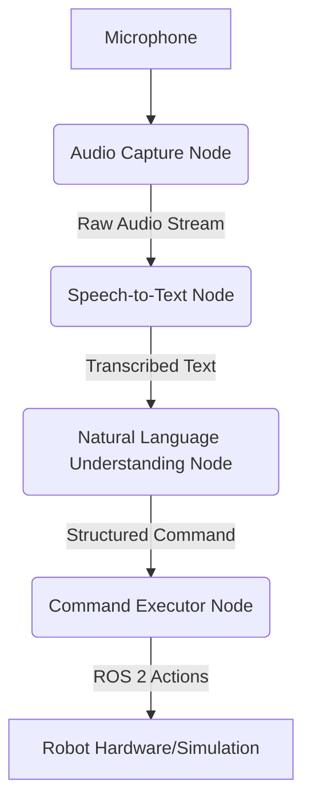

# Chapter 1: Voice Commands with Whisper and LLMs

Welcome to the final module of our journey into physical AI. In this module, we're going to explore one of the most exciting and rapidly advancing areas of robotics: creating robots that can understand and respond to natural language.

This chapter will introduce you to the architecture of a voice command system that combines **Whisper** for speech-to-text, a **Large Language Model (LLM)** for natural language understanding, and **ROS 2** for robotic control.

## The Vision: A Robot You Can Talk To

Imagine being able to simply say, "Robot, please pick up the red ball and bring it to me," and have the robot understand and execute the command. This is the promise of Vision-Language-Action (VLA) models, and it's closer than you might think.

To achieve this, we need a system that can:
1.  **Hear** our voice command.
2.  **Understand** the intent behind our words.
3.  **Translate** that intent into a series of robotic actions.
4.  **Execute** those actions.

## The Architecture of a Voice Command System

A modern voice command system in ROS 2 can be broken down into a pipeline of several specialized nodes:



Let's look at each component in detail.

### 1. Audio Capture Node

This is the robot's "ear." Its sole job is to capture raw audio from a microphone and publish it to a ROS 2 topic. This node might also include **Voice Activity Detection (VAD)** to filter out silence and only publish when someone is actually speaking, which improves efficiency.

### 2. Speech-to-Text (STT) Node

This node subscribes to the raw audio stream and uses a speech-to-text model to convert the spoken words into a text string. For this, we use **OpenAI's Whisper**, a powerful and highly accurate open-source STT model.

To run Whisper efficiently on a robot's embedded computer, we often use optimized versions like `whisper.cpp`. The output of this node is the transcribed text (e.g., "please pick up the red ball"), which is then published to another ROS 2 topic.

### 3. Natural Language Understanding (NLU) Node

This is the "brain" of our voice command system. This node takes the transcribed text and uses a **Large Language Model (LLM)** to understand the user's intent.

The goal here is not just to understand the words, but to extract a structured command. We can achieve this through careful **prompt engineering**, where we instruct the LLM to output a JSON object that represents the command.

For example, for the input "please pick up the red ball," we would want the LLM to generate something like:

```json
{
  "action": "pick_up",
  "object": {
    "color": "red",
    "type": "ball"
  }
}
```

This structured data is much easier for a robotic system to work with than the original, unstructured text.

### 4. Command Executor Node

This node subscribes to the structured commands from the NLU node and translates them into actual ROS 2 actions. It acts as the bridge between the world of language and the world of robotic control.

When it receives the JSON command from our example, it would:
1.  Parse the JSON object.
2.  Identify that the action is `pick_up`.
3.  Use the robot's perception system to locate a red ball.
4.  Call the appropriate ROS 2 services or actions to execute the picking motion.

## What's Next?

In this chapter, you've learned about the high-level architecture for building a voice-controlled robot. You've seen how we can create a pipeline of ROS 2 nodes to go from spoken words to robotic action.

In the final chapter of this book, we will explore **cognitive planning**, where we'll discuss how the structured commands from an LLM can be used to generate and execute complex, multi-step plans, enabling our robots to perform even more sophisticated tasks.
