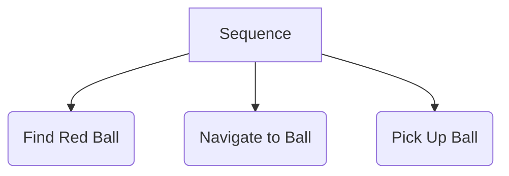

# Chapter 2: Cognitive Planning

In the previous chapter, we built a system that could understand a spoken command and translate it into a structured JSON object. This is a huge step, but it's not the end of the story. How do we go from a high-level goal like `{"action": "pick_up", "object": {"color": "red", "type": "ball"}}` to the low-level motor commands needed to execute it?

This is the domain of **cognitive planning**. In this final chapter, we'll explore how to bridge the gap between understanding and action, using the structured output of a Large Language Model (LLM) to generate and execute a plan.

## From Intent to Action

The Command Executor Node we introduced in the last chapter needs to be more than just a simple dispatcher. It needs to be a **task planner**. Its job is to take a high-level goal and decompose it into a sequence of concrete, achievable steps.

For example, to pick up a red ball, the robot needs to:
1.  **Locate** the red ball in its environment.
2.  **Navigate** to a position where it can reach the ball.
3.  **Open** its gripper.
4.  **Extend** its arm to the ball's position.
5.  **Close** its gripper.
6.  **Retract** its arm.

Each of these steps corresponds to a specific ROS 2 action or service call.

## LLMs as Task Planners

One of the most exciting developments in modern robotics is the use of LLMs not just for understanding language, but for planning as well. Instead of just outputting a single JSON object, we can prompt an LLM to generate a full sequence of steps.

### A More Advanced Prompt

We can engineer our prompt to ask the LLM to act as a task planner.

**Input to LLM (from STT Node):** "please pick up the red ball"

**Our engineered prompt (simplified):**
```
You are a robotic task planner. Your goal is to take a user's command and break it down into a sequence of executable steps from the following list of available actions:
- find_object(object_type, color)
- go_to(x, y, z)
- open_gripper()
- close_gripper()
- move_arm(x, y, z)

Given the user command: "please pick up the red ball", what is the sequence of actions? Output your answer as a JSON array.
```

**Potential LLM Output:**
```json
[
  { "action": "find_object", "params": { "object_type": "ball", "color": "red" } },
  { "action": "go_to", "params": { "x": 1.2, "y": -0.5, "z": 0.0 } },
  { "action": "open_gripper", "params": {} },
  { "action": "move_arm", "params": { "x": 1.2, "y": -0.5, "z": 0.2 } },
  { "action": "close_gripper", "params": {} },
  { "action": "move_arm", "params": { "x": 0.0, "y": 0.0, "z": 0.5 } }
]
```
*(Note: The coordinates in this example are placeholders that the robot's perception and planning system would fill in.)*

## The Role of Existing Robotics Frameworks

While LLMs are great at high-level planning, they are not a replacement for the robust, real-time control systems that have been developed in robotics over decades. The output of the LLM should be seen as a high-level "script" that is then executed by a more traditional robotics framework.

### Behavior Trees

A powerful way to structure the execution of these plans is with **Behavior Trees (BTs)**. A BT is a way of organizing a set of tasks in a tree-like structure. They are more flexible than simple sequential plans, as they can handle failures and adapt to changing conditions.

For example, a BT for our "pick up the red ball" task might look like this:



Each of these high-level tasks in the BT would then be broken down into the low-level ROS 2 service and action calls. The output of the LLM can be used to dynamically construct or select the appropriate Behavior Tree to execute.

## The Future of Physical AI

You are now at the cutting edge of modern robotics. By combining:
*   **ROS 2:** for robust, modular robotic control.
*   **Realistic Simulation (Isaac Sim, Gazebo):** for safe and scalable development.
*   **Advanced Perception (Isaac ROS):** to give your robot an understanding of its world.
*   **LLMs (Whisper, etc.):** to provide a natural language interface and high-level reasoning.

...you have all the tools you need to build truly intelligent, interactive, and useful robots.

Congratulations on completing this journey through the fundamentals of physical AI. The field is moving at an incredible pace, and we can't wait to see what you will build.
